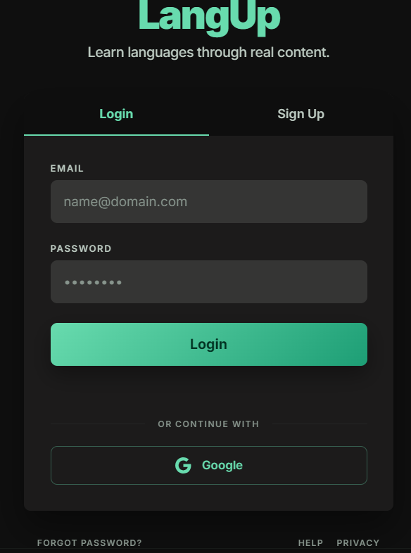
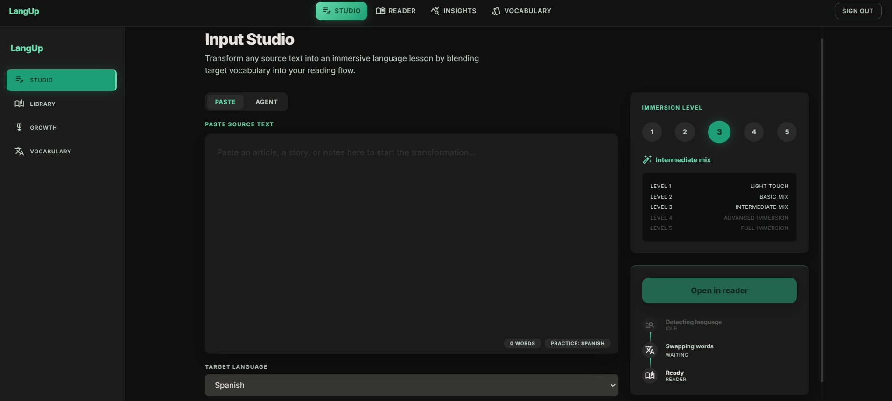
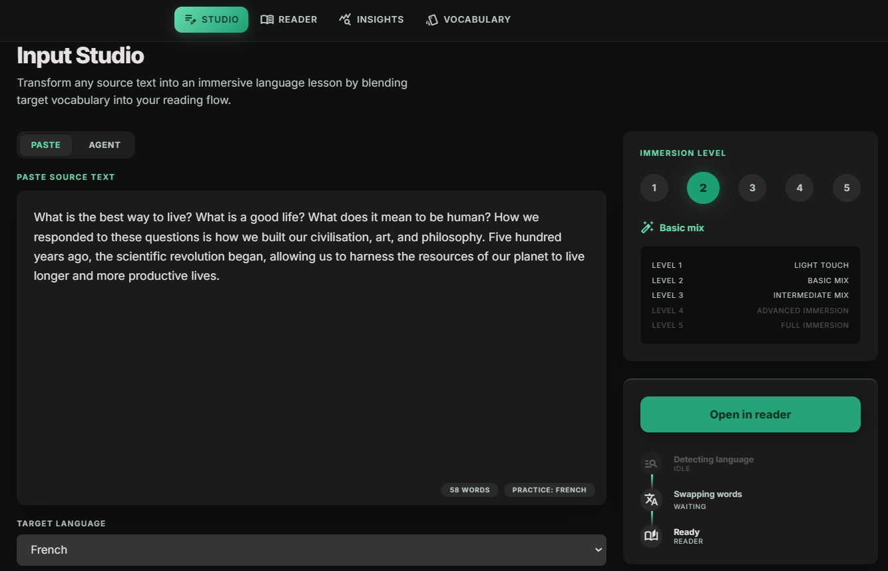
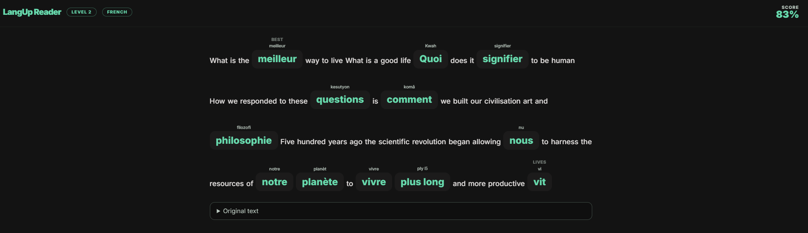
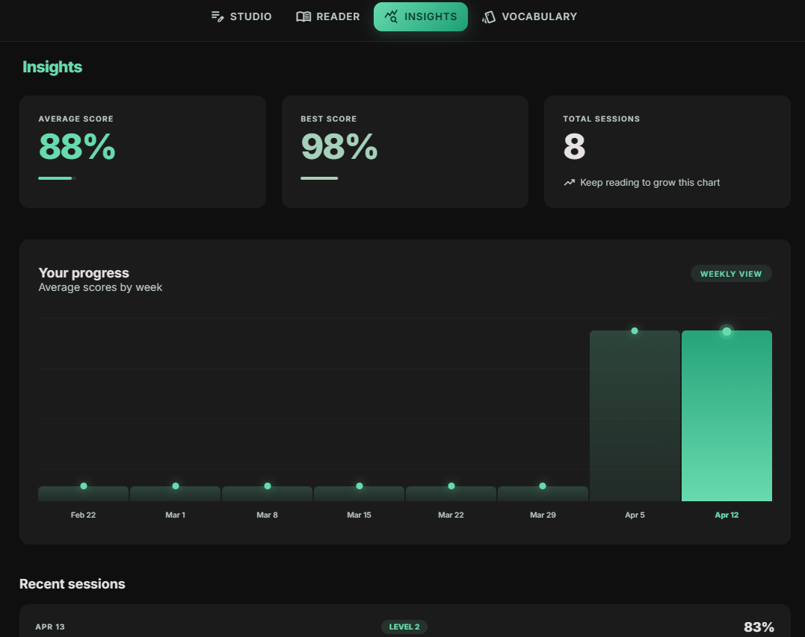
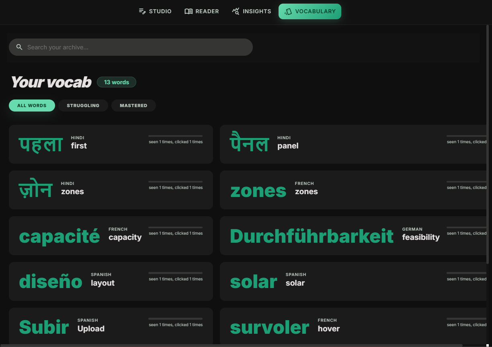

# LangUp

**Immersive language learning through the content you already read.**

LangUp blends your target language into any English passage using a technique called *code-switching* — the same mechanism linguists observe in natural bilingual environments. Rather than drilling flashcards in isolation, you encounter new words inside context you care about, which is where retention actually happens.


---

## Screenshots

| | |
|---|---|
|  |  |
| **Authentication** — Supabase-backed login and sign-up with per-user language profiles. | **Input Studio** — Paste any text and configure your target language and immersion level before blending. |
|  |  |
| **Live Blend Preview** — GPT-4o-mini classifies and swaps eligible words in real time before you enter the Reader. | **Immersive Reader** — AI-blended words are rendered inline; click any green word to reveal its translation and log a vocabulary hit. |
|  |  |
| **Insights Dashboard** — 8-week progress chart driven by per-session accuracy scores stored in Supabase. | **Vocabulary Archive** — Every encountered word tracked with a mastery score, filterable by Struggling / Mastered. |

---

## How It Works

1. Paste any English text — an article, a recipe, a song lyric, a chapter.
2. Choose a target language and an immersion level (1–5).
3. LangUp's NLP pipeline classifies every word by part of speech, probabilistically samples eligible words, and translates them via GPT-4o-mini.
4. Read the blended passage. Click any word you don't recognize — it reveals the translation and fires a mastery penalty.
5. End the session. Mastery scores update across your vocabulary, and weak words are injected into future AI chat prompts for passive reinforcement.

---

## Architecture

```
┌──────────────────────────────────────────────────────────────┐
│                        Browser (React)                        │
│                                                              │
│  InputScreen   ──►  ReaderScreen  ──►  DashboardScreen      │
│  (Paste / Agent)    (Blended text)     (Progress + Charts)  │
│                          │                                   │
│                   VocabScreen  (Mastery archive)             │
└──────────────────────────┬───────────────────────────────────┘
                           │ REST / JSON
┌──────────────────────────▼───────────────────────────────────┐
│                    Express API  (:4000)                       │
│                                                              │
│  /api/blend        NLP word-swap pipeline  ──►  OpenAI       │
│  /chat             code-switching agent    ──►  OpenAI       │
│  /api/studio/chat  text-drafting agent     ──►  OpenAI       │
│  /vocab            mastery score CRUD                        │
│  /sessions         session save + aggregation                │
│  /auth             signup / login / logout                   │
└──────────────────────────┬───────────────────────────────────┘
                           │ Supabase JS SDK
┌──────────────────────────▼───────────────────────────────────┐
│                 Supabase (Postgres + Auth)                    │
│                                                              │
│   auth.users   profiles   vocabulary   sessions              │
└──────────────────────────────────────────────────────────────┘
```

---

## ML & AI Engine

> **LangUp uses machine learning at three distinct layers** — NLP-based token classification to decide *which* words to swap, a probabilistic sampling model to control *how many* based on immersion level, and a fine-temperature-controlled LLM to handle the actual translation and code-switching generation. These aren't independent features: they form a pipeline where each layer's output feeds the next.

### Model: GPT-4o-mini — and why not GPT-4o

All AI endpoints run on **`gpt-4o-mini`**. The choice is a deliberate ML infrastructure decision:

| Metric | GPT-4o | GPT-4o-mini | LangUp's need |
|---|---|---|---|
| Latency per call | 2–4 s | 400–800 ms | Per-word, synchronous loop — latency stacks |
| Cost per 1M tokens | ~$5 input / $15 output | ~$0.15 input / $0.60 output | 15–20× cheaper at blend-loop scale |
| Task complexity | Open-ended reasoning | Structured extraction | Translation is a lookup, not reasoning |
| Determinism | Variable | Controllable via `temp: 0` | Translation must be consistent across sessions |

**Translation calls run at `temperature: 0`** — fully deterministic. The same English word always maps to the same target-language equivalent, which is critical for vocabulary tracking (mastery scores are keyed on exact word strings). Conversational chat runs at `temperature: 0.8` to feel natural. Studio drafting at `temperature: 0.7` balances fluency with focus.

---

### Layer 1 — NLP Token Classification

Before any API call is made, the backend runs a rule-based NLP classifier over the input text:

```
Input text  →  tokenize  →  POS-tag each token
                              │
                    ┌─────────┼──────────┐
                 noun      verb      adjective     ←  eligible pool
                              │
                    article / preposition           ←  always excluded
```

**Why exclude articles and prepositions?** These are grammatical function words (`the`, `a`, `of`, `in`). Swapping them breaks sentence structure and makes the text unreadable regardless of level. The classifier protects them unconditionally — no LLM call is ever made for these tokens.

---

### Layer 2 — Probabilistic Sampling by Immersion Level

From the eligible pool, a **level-controlled random sampler** decides which specific words get swapped:

| Level | Name | Eligible POS | Sampling Rate |
|---|---|---|---|
| 1 | Light Touch | Nouns only | 10% |
| 2 | Basic Mix | Nouns + Adjectives | 20% |
| 3 | Intermediate Mix | Nouns + Adjectives + Verbs | 35% |
| 4 | Advanced Immersion | All content words | 55% |
| 5 | Full Immersion | All content words | 80% |

The sampling is intentionally **random per session** — the same text at Level 3 will produce a different word selection each time. This prevents the user from memorizing positional cues ("the third word in line 2 is always French") and forces genuine recognition of the word itself.

---

### Layer 3 — LLM Translation with Structured Output

For each sampled word, GPT-4o-mini is called with a tightly constrained system prompt:

```
System: "You are a language translation assistant.
         Given an English word and a target language,
         return ONLY a JSON object with no markdown:
         { swapped: string, romaji: string, translation: string }"
temperature: 0
```

Forcing JSON-only output eliminates parsing overhead and hallucination risk. The `romaji` field is populated only for CJK scripts (Japanese, Korean, Mandarin) to provide pronunciation scaffolding in the Reader.

---

### Layer 4 — Code-Switching Chat Agent

The discussion endpoint goes beyond translation into **generative code-switching** — producing natural language that flows between English and the target language at a specified density:

```
System prompt encodes level rules:
  Level 1:  5–10%  → common nouns/adjectives only
  Level 2: 10–15%  → nouns and adjectives
  Level 3: 15–25%  → nouns, adjectives, simple verbs
  Level 4: 25–40%  → most word types + short phrases
  Level 5: 30–50%  → full phrases, complex grammar, cultural expressions

Output format enforced:  {{target_word|english_translation}}
```

The model must emit every non-English word in the `{{target|native}}` token format. The frontend parses these with a regex and renders them as interactive word-stacks. **Weak vocabulary words** (mastery score < 0.3) are injected into the system prompt so the model naturally weaves them into the response — passive reinforcement without the user seeing the mechanism.

---

### Layer 5 — Adaptive Mastery Scoring

The mastery system functions as a **lightweight online learning model** — it updates per observation without requiring a batch training step:

```python
INITIAL_MASTERY = 0.30

# Passive exposure (word appeared in a session)
mastery = min(1.0, mastery + 0.05)

# Active failure (user clicked to reveal translation)
mastery = max(0.0, mastery - 0.15)
```

The **asymmetric learning rate** (penalty 3× larger than reward) is the key design choice. It mirrors the actual cognitive asymmetry of language acquisition: seeing a word doesn't mean you know it, but failing to recognize it is a strong signal. Words that drop below `0.30` are classified as weak and recycled into the AI chat context automatically.

**Mastery tiers:**

| Score | Status | Action |
|---|---|---|
| < 0.30 | Struggling (Red) | Injected into future AI prompts for reinforcement |
| 0.30 – 0.69 | Learning (Amber) | Tracked, shown in vocab archive |
| ≥ 0.70 | Mastered (Green) | Excluded from weak-word injection |

---

## Tech Stack

### Frontend
| Layer | Choice | Why |
|---|---|---|
| UI Framework | React 19 + TypeScript | Concurrent rendering, strict type safety |
| Routing | React Router DOM 7 | Nested routes, data loaders |
| Build | Vite | Sub-second HMR vs CRA's Webpack overhead |
| Auth state | Context API + localStorage | Lightweight — no Redux needed for a single-user token |
| API client | Custom typed `fetch` wrapper | Zero-dependency, fully typed request/response shapes |
| Supabase client | `@supabase/supabase-js` 2.x | Direct realtime subscriptions without extra infra |

### Backend
| Layer | Choice | Why |
|---|---|---|
| Runtime | Node.js + Express 5 | Async-first, mirrors OpenAI SDK's promise model |
| Validation | `express-validator` | Declarative, composable input sanitization |
| Auth middleware | Supabase JWT verification (raw HTTP) | Works with all key formats; no extra library |
| AI SDK | `openai` Node SDK 4.x | Streaming-ready, typed responses |

### Data
| Layer | Choice |
|---|---|
| Database | Supabase (Postgres) |
| Auth | Supabase Auth (email/password + JWT) |
| Row-level security | Enabled on all tables — users can only read/write their own rows |

---

## Session Scoring

```
score = ((total_words_swapped - words_clicked) / total_words_swapped) × 100
```

Higher score = more swapped words recognized without clicking. This compounds across sessions into the 8-week progress chart.

---

## API Reference

All protected endpoints require `Authorization: Bearer <token>`.

| Method | Endpoint | Auth | Purpose |
|---|---|---|---|
| `POST` | `/auth/signup` | — | Create account |
| `POST` | `/auth/login` | — | Get JWT token |
| `POST` | `/auth/logout` | ✓ | Invalidate session |
| `POST` | `/api/blend` | ✓ | NLP classify + word-swap a passage |
| `POST` | `/chat` | ✓ | Code-switching discussion agent |
| `POST` | `/api/studio/chat` | ✓ | Studio drafting agent |
| `GET` | `/vocab` | ✓ | All vocabulary |
| `GET` | `/vocab/weak` | ✓ | Words with mastery < 0.3 |
| `POST` | `/vocab/record-click` | ✓ | Log word click + update mastery |
| `POST` | `/vocab/record-seen-batch` | ✓ | Batch log passive exposures |
| `POST` | `/sessions` | ✓ | Save reading session |
| `GET` | `/sessions` | ✓ | Session history + summary stats |
| `GET` | `/sessions/progress` | ✓ | 8-week aggregated chart data |

---

## Database Schema

```sql
-- User profiles (extends Supabase auth.users)
profiles (
  id              uuid PRIMARY KEY,  -- matches auth.uid()
  target_language text,
  proficiency_level int DEFAULT 1
)

-- Per-word mastery tracking (the ML feedback loop lives here)
vocabulary (
  id              uuid PRIMARY KEY,
  user_id         uuid REFERENCES auth.users,
  word_native     text,              -- target language word
  word_english    text,              -- English gloss
  language        text,
  times_seen      int,
  times_clicked   int,
  mastery_score   float,             -- 0.0 → 1.0, updated per session
  first_seen      timestamptz,
  last_seen       timestamptz,
  last_clicked    timestamptz
)

-- Reading session records
sessions (
  id                  uuid PRIMARY KEY,
  user_id             uuid REFERENCES auth.users,
  content_snippet     text,          -- first 280 chars of source
  total_words_swapped int,
  words_clicked       int,
  level_used          int,
  score               float,         -- ((swapped - clicked) / swapped) × 100
  created_at          timestamptz DEFAULT now()
)
```

Row-level security is enabled on all tables. All reads and writes are scoped to the authenticated user.

---

## Running Locally

**Prerequisites:** Node 18+, a Supabase project, an OpenAI API key.

```bash
# Backend
cd backend
cp .env.example .env        # fill in SUPABASE_URL, SUPABASE_ANON_KEY, OPENAI_API_KEY
npm install
npm run dev                  # http://localhost:4000

# Frontend (separate terminal)
cd frontend
npm install
npm start                    # http://localhost:3001
```

The frontend proxies API requests to `http://localhost:4000` via the `proxy` field in `package.json`.

---

## Environment Variables

**`backend/.env`**
```
PORT=4000
SUPABASE_URL=https://<project>.supabase.co
SUPABASE_ANON_KEY=eyJ...
OPENAI_API_KEY=sk-proj-...
```

**`frontend/.env`**
```
REACT_APP_SUPABASE_URL=https://<project>.supabase.co
REACT_APP_SUPABASE_ANON_KEY=eyJ...
```

---

## Supported Languages

Japanese · Spanish · French · German · Korean · Mandarin · Arabic · Hindi

Romaji transliteration is returned for CJK scripts (Japanese, Korean, Mandarin) to aid pronunciation while reading.

---

## Project Structure

```
ynrjc/
├── backend/
│   ├── index.js               Express entry point
│   ├── middleware/
│   │   └── auth.js            JWT verification via Supabase HTTP API
│   ├── routes/
│   │   ├── auth.js
│   │   ├── blend.js           NLP classifier + word-swap pipeline
│   │   ├── chat.js            Code-switching discussion agent
│   │   ├── studio.js          Text drafting agent
│   │   ├── vocab.js           Mastery score CRUD
│   │   └── sessions.js        Session recording + aggregation
│   └── services/
│       └── supabase.js        Supabase client singleton
│
└── frontend/
    └── src/
        ├── App.jsx             Router + AuthProvider
        ├── context/
        │   └── AuthContext.tsx Auth state + hooks
        ├── lib/
        │   ├── api.ts          Typed REST client
        │   └── supabase.ts     Supabase client
        ├── pages/
        │   ├── AuthScreen.tsx
        │   ├── InputScreen.tsx  Paste + Agent modes
        │   ├── ReaderScreen.tsx Blended reading with word-click tracking
        │   ├── VocabScreen.tsx  Mastery archive
        │   └── DashboardScreen.tsx Progress + charts
        └── components/
            └── NavBar.tsx
```
